# BMR App Acoustics – Quick Guide

Welcome to better **acoustics** for **better meetings** with **BMR Acoustics**.

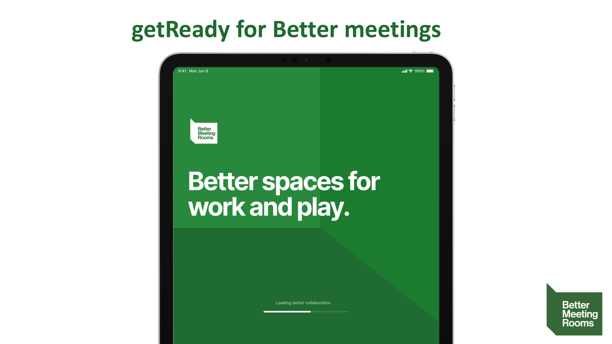

---

## Before You Start

You'll need:
- An iPhone or iPad
- A speaker (Bluetooth or AirPlay) **or** a **balloon**
- A quiet room

**Instructions:**
- Close all windows and doors
- Turn off all noise sources (HVAC, electronics, etc.)
- Protect your ears
- If using a speaker, start at medium volume
- If using a balloon, hold it ~30 cm away before popping

**Pro Tips:**
- Place the speaker or balloon **away** from the iPhone/iPad
- Ensure your device's microphone is **uncovered**
- Place the device on a **stable, non-rattling surface**
- Multiple measurements = more reliable data

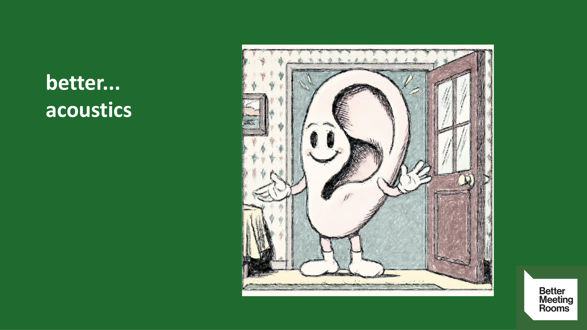

---

## Starting the App

1. **Launch the app** and press `Continue`.

2. Choose your test method:
   - **Sweep**: Plays a test sound via connected speaker
   - **Impulse**: Records a **balloon pop** or **hand clap**
     > ⚠️ Hand claps are inconsistent — use only as a last resort.

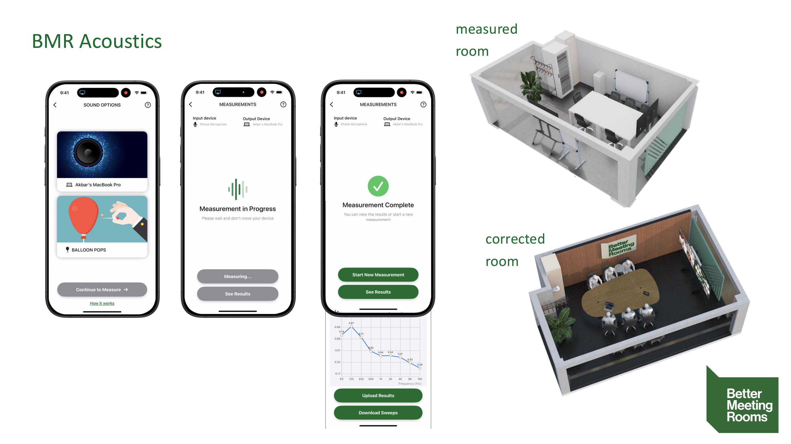

---

## Using the Sweep Method

### Step 1: Connect a Speaker

- Use at least a medium-sized Bluetooth speaker
- Should fill the room with noticeable sound
- If your speaker is too small, consider using the balloon method

If the speaker appears in the app:
- Tap the exclamation mark (!) to open a popup
- Select your speaker from the list

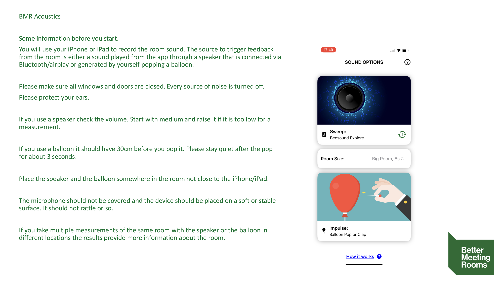

### Step 2: Start Measurement

- Internal mic + connected speaker should be shown
- Begin with **medium volume**
- **Protect your ears**
- Tap `Start Measurement`

> Do not move or make noise during the measurement!

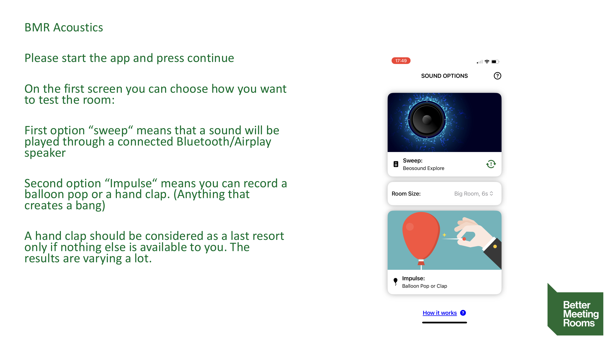

### Step 3: View Results

- Wait for the **"Measurement Complete"** screen
- Tap `See Results`
- If results are poor, increase volume or reduce noise and retry

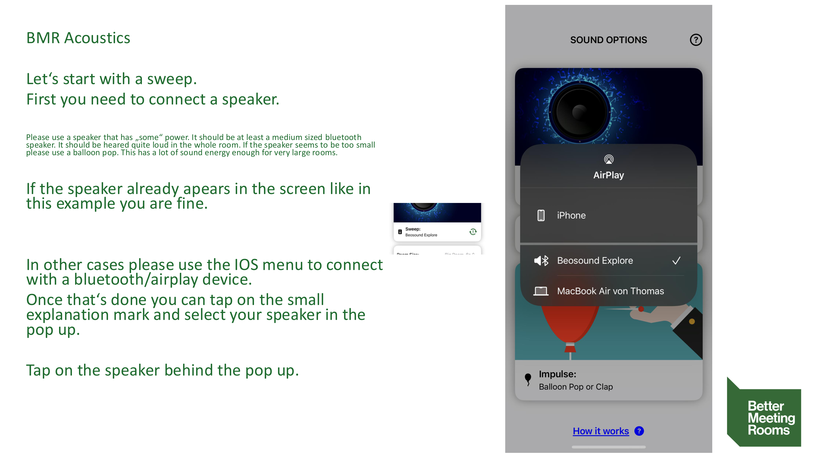

### Step 4: Share Results

- Tap `Share Results`
- Use your preferred messaging app to send data to BMR

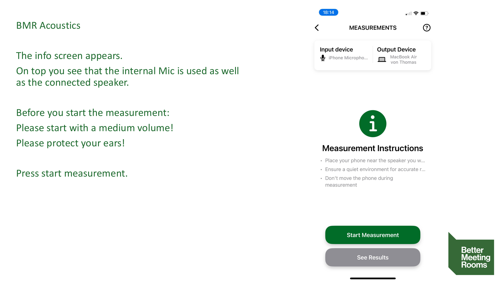

---

## Using the Impulse (Balloon Pop) Method

### Step 1: Tap the Balloon Icon

- A countdown begins
- You will see the **ambient noise level**
- **Avoid all background noise**

> If the noise floor is too high, the app will show a measurement error

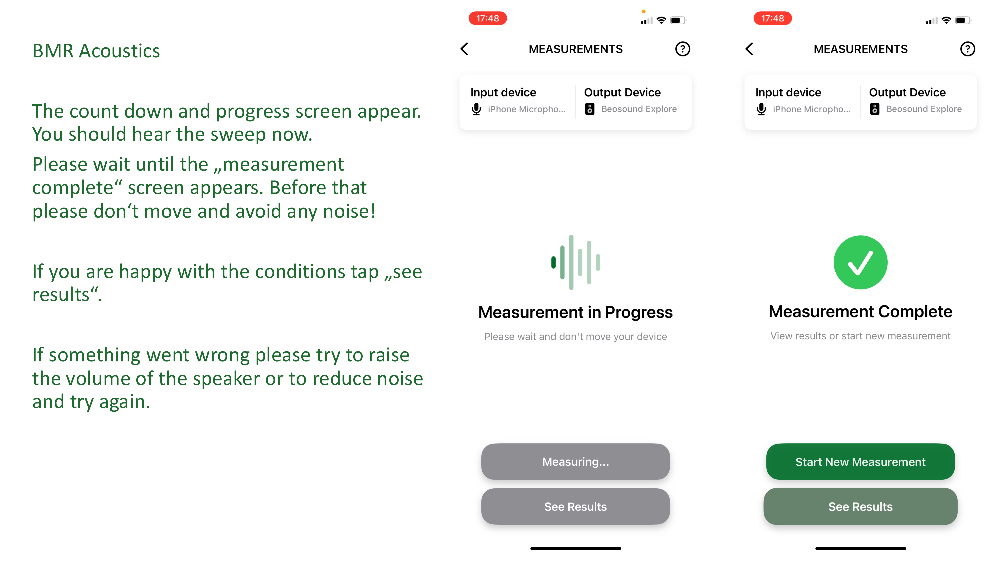

### Step 2: Make the Impulse

- When prompted: **Pop the balloon**
- Remain silent for about 3 seconds

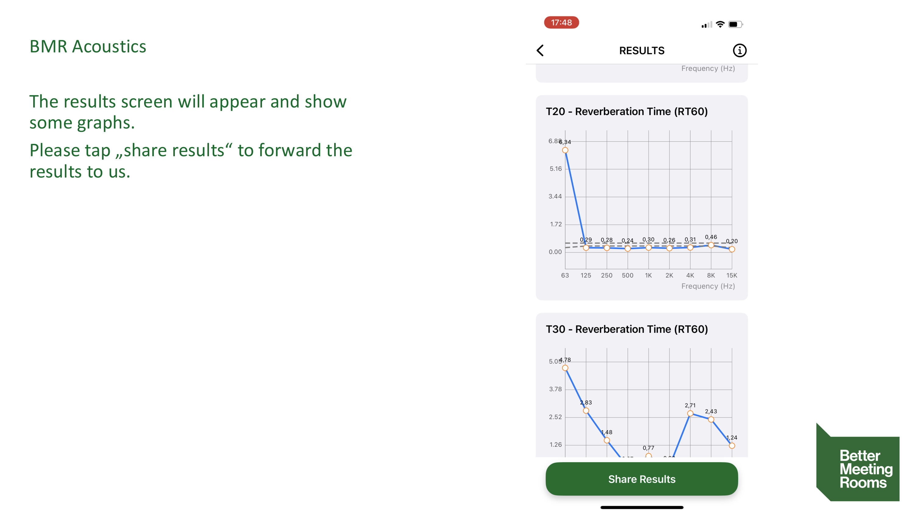

### Step 3: View & Share Results

- The app will show the results once the impulse is detected
- Share results using the same method as above

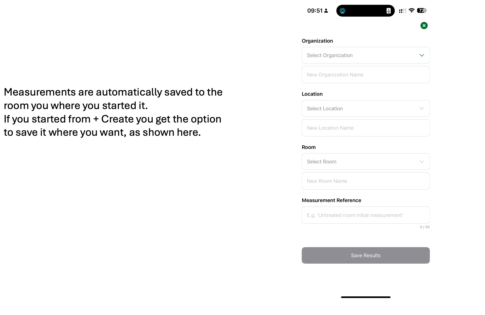

---

## Next Steps

Your data helps calculate **reverberation times** and required **room absorption** to optimize **speech intelligibility**.

More info: [www.bettermeetingrooms.com/getready](https://www.bettermeetingrooms.com/getready)

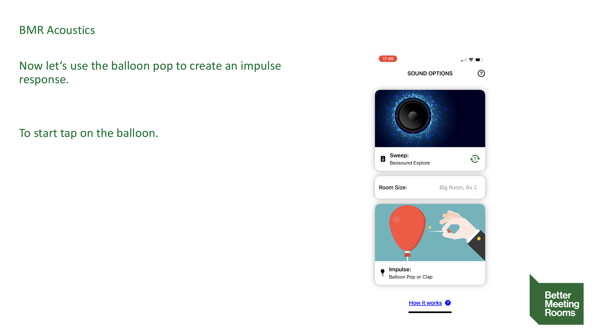
