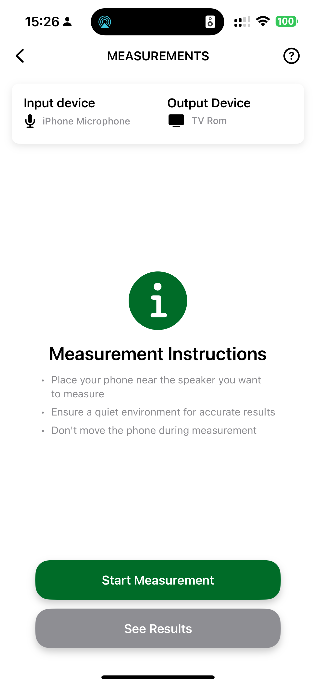

# 📐 Room Scanning & Marker Tutorial

This guide shows how to perform a room scan and place markers using the Better Meeting Rooms iPhone/iPad app.

---

## 🚀 Starting a Scan

You can initiate a scan in two ways:

**From the Create menu:**  

**From a Room page:**  

---

## 🔍 Scanning in Progress

Once started, follow on-screen instructions to move your phone along the walls of the room.

**Scan screen when beginning:**  

**White lines appear as room geometry is captured:**  

Move around until:
- White lines have covered all walls and corners
- The 3D preview closely matches the real room

---

## 📸 Taking Markers

During scanning:
- Tap the **camera icon** (center bottom) to take a marker photo
- The icon in the bottom-left corner updates with a marker count
- Tap that icon to preview markers taken
- Long press a marker in the preview to delete it

**Markers being taken:**  

**Marker preview gallery:**  

---

## ✅ Finalizing the Scan

When you believe the scan is complete, tap **Finish scanning**.

You’ll see a preview of the scanned digital twin:

**Scan review screen:**  

You can now choose:
- **Proceed** – save the scan
- **Retake** – discard and restart

If the scan was initiated from a room page, it’s automatically saved to that room.  
If started from **+ Create**, you’ll be prompted to assign it to an **existing or new**:
- Organisation
- Location
- Room

---

ℹ️ Stay tuned for more tutorials.
